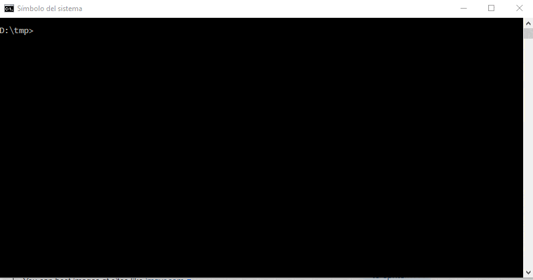

# mapea-create-plugin
Herramienta para el desarrollo de plugins en [Mapea](https://github.com/sigcorporativo-ja/Mapea4)

**Requisitos e instalación de dependencias**

* Node.js (version >=8.x.x)
# Instalación de la herramienta
Realizamos la instalación de forma global para disponer de la herramienta en cualquier parte de nuestro equipo:

```shell
$ npm install -g mapea-create-plugin
```
# Creación de plugins
**1. Creación de plugin base**  
Tarea que crea la estructura para un nuevo plugin:  
```shell
$ mapea-create-plugin
```
Solicitará el nombre del plugin, así como la versión de Mapea sobre la que se desee trabajar. También nos preguntará si queremos que se instalen automáticamente las dependencias del plugin.
> :point_right:  <a> Para la guía de desarrollo, supondremos que hemos proporcionado el nombre de **'miPlugin'** </a>  

Creará la estructura de directorios y los ficheros necesarios para la construcción de un plugin dentro de una carpeta con el nombre '_miplugin_' en el lugar donde se haya ejecutado la herramienta. 
Este plugin es autocontenido y ya contiene los scripts de pruebas y compilación, e incluye una funcionalidad básica de ejemplo 'Hola mundo'.

En este punto, **deberemos desarrollar la funcionalidad específica de nuestro plugin**. Para ello, la [guía de desarrollo](https://github.com/sigcorporativo-ja/Mapea4-dev/wiki) entra en detalle acerca de los métodos que lo forman y qué debe incluir cada uno.
Si es necesaria la instalación de alguna dependencia (p.e. _lodash_), puede realizarse de forma habitual, ejecutando dentro del directorio del plugin el siguiente comando:
```shell
$ npm install --save lodash
```
El modificador _--save_ o _-S_ sirve para que, además de instalar la dependencia, la añada al fichero _package.json_, encargado de gestionar dichas dependencias.

**Pruebas**  

Aunque en su fase final un plugin se compilará y generará un único fichero js, durante la fase de desarrollo el código fuente del mismo se organiza en varios ficheros. Para poder testear el plugin entraremos en la carpeta '_miplugin_' y ejecutaremos: 
```shell
npm start
```
 Este comando levantará un entorno de desarrollo que recargará la compilación de webpack automáticamente por cada vez que actualicemos el código de '_miplugin_'. El fichero html lo podemos encontrar en '_miplugin/test/dev.html_', así como '_miplugin/test/index.js_', donde escribiremos el código de pruebas para testear nuestro plugin. En el navegador accedemos a:

```html
http://localhost:6123
```  
Y se nos abrirá la página _'dev.html'_.


**2.- Check plugin**  
Tarea para validar código con [ESLint](https://eslint.org/):
```shell
$ npm run check
```
También se facilita un script de npm para arreglar la mayoría de los erorres de typing que se cometen mientras se desarrolla.

```shell
$ npm run fix
```

**3.- Build plugin**  
Compila y minimiza los plugins creados. Aunque el plugin está compuesto por varios ficheros javascript y de estilo, para mejorar la eficiencia en su uso, la versión final de los plugins se compila y comprime, generando un único fichero css y un único fichero js:
```shell
$  npm run build
```
Se generará en la carpeta 'build/miplugin' los ficheros _css_ y _js_ comprimidos finales.

En caso de que queramos testear en modo producción solo tendremos que hacer:
```shell
npm run test-build
```
Esto levantará un http-server que consumirá los recursos generados en build, simulando un servidor den producción. El código adcional que queramos ejecutar, tendremos que escribirlo en '_prod.html_' en la carpeta '_src/tests_'.
> :point_right: Importante haber hecho antes `npm run build` o no tendremos creada la compilación del plugin, que es donde apunta


